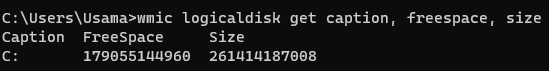

# Operating Systems & Networking Lab

## Task 1: Operating System Analysis

## 1. Analyze Disk Space:
To check the available disk space on my operating system I used the following command:

> wmic logicaldisk get caption, freespace, size

**Output:**

## 2. Resource Consumption Analysis:

To identify the process consuming the most RAM and CPU on my operating system, I did not use any command I just check from task manager because I am using Windows Opreating system:
1. Go on search bar and search for Task Manager
2. In the Task Manager window, you will see several tabs, like CPU, Memory, Disk and Network.

**Output:**

