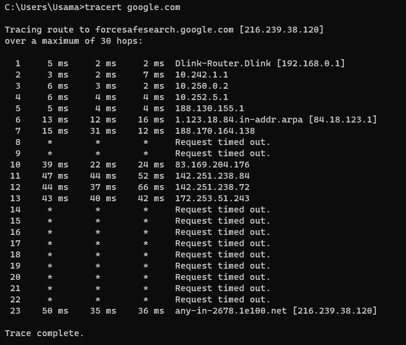

# Task 2: Networking Analysis

## 1. Traceroute

Traceroute is a network diagnostic tool that helps trace the path of network packets from a source device to a destination. By sending packets with increasing TTL values and recording the IP addresses of intermediate routers, traceroute provides insights into the network path and latency. It is commonly used to troubleshoot network connectivity issues, identify potential bottlenecks, and analyze the performance of network connections.

I will use the following command for Traceroute:

>tracert google.com

